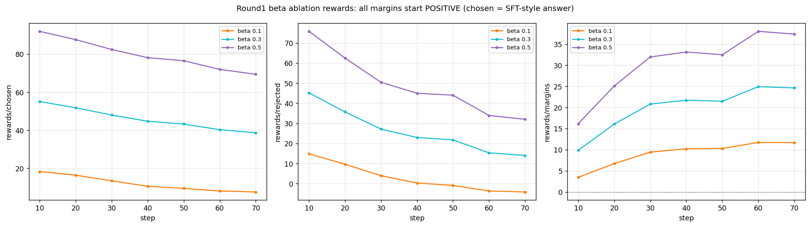
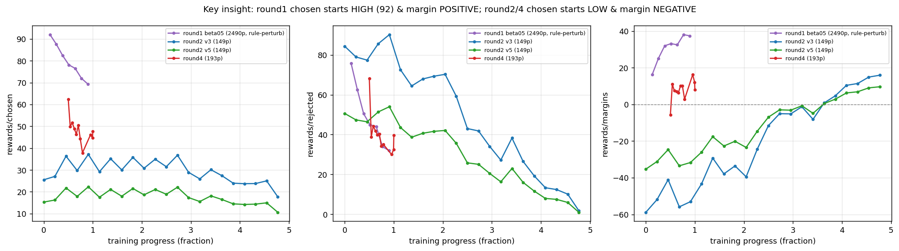

# 阶段 05 · DPO 训练

**日期**: 2026-08-09 — 2026-08-14
**关联**: [phase5-dpo-training-design.md](../../docs/superpowers/specs/phase5-dpo-training-design.md) | [phase5-dpo-training-plan.md](../../docs/superpowers/plans/phase5-dpo-training-plan.md)
**前置**: Phase 4 SFT v4 完成（准确性 92.5%，审慎度 0.93 横盘，拒答 0.13 横盘）

---

## 1. DPO 原理与引入动机

### 1.1 SFT 的边界

SFT（Supervised Fine-Tuning）通过最大化 P(answer|question) 训练模型。它的优化目标是"对所有输入产生好的回答"。这在大部分场景下是正确的，但在两类边界场景下失效：

- **信息不足**（审慎度）：用户描述不充分，模型应该追问而非猜测
- **超出能力**（拒答）：用户要求起草文书/审查合同/精确计算，模型应该礼貌拒答而非勉强编造

SFT 训练分布中，卡 1（给完整答案）:卡 2（追问）:卡 5（拒答）≈ 3,701:700:79。模型学到的信号是"给答案是安全的"——这不是数据质量问题，是**SFT 的优化目标和此类行为需求之间的结构性冲突**。

### 1.2 DPO 的原理

DPO（Direct Preference Optimization, Rafailov et al., 2023）提供了一种直接优化偏好信号的训练方法。其核心思想是：给定一对回答（chosen > rejected），直接调整模型使得 chosen 相对 rejected 的概率比增大。

**数学形式**：

DPO 的损失函数为：

$$L_{DPO}(\pi_\theta; \pi_{ref}) = -\mathbb{E}_{(x, y_c, y_r) \sim D}\left[\log \sigma\left(\beta \cdot \left[\log\frac{\pi_\theta(y_c|x)}{\pi_{ref}(y_c|x)} - \log\frac{\pi_\theta(y_r|x)}{\pi_{ref}(y_r|x)}\right]\right)\right]$$

#### 其中：

- $\pi_\theta$ 是正在训练的 policy 模型
- $\pi_{ref}$ 是 reference 模型（本项目为 SFT v4 权重，冻结）
- $y_c$ 是 chosen（偏好对中的好回答）
- $y_r$ 是 rejected（偏好对中的差回答）
- $\beta$ 控制 policy 不得偏离 reference 太远的惩罚强度
- $\sigma$ 是 sigmoid 函数

**直观理解**：DPO 不直接教模型"正确的回答长什么样"（那是 SFT 的事），而是教模型"对于这个具体的问题，chosen 的回答方式比 rejected 更好"。由于 chosen 和 rejected 共享同一个 prompt，模型学到的偏好是**上下文绑定的**——"信息不足时，追问比猜答案更好"。

**物理含义**：
- loss 下降 ≈ 模型输出的 logit 分布在 chosen 和 rejected 之间的 margin 在增大
- $\beta$ 小（0.1）→ margin 可以拉很大，但模型可能过度偏离 SFT 学到的格式
- $\beta$ 大（0.5）→ margin 被限制，偏好信号弱但格式保持稳定

### 1.3 为什么不选 PPO/GRPO

| 方法 | 机制 | 本项目的适用性 |
|------|------|------|
| **DPO** | 离线偏好对 → 对比损失 | ✅ 错误模式可枚举（P2-P6），偏好对构造廉价 |
| PPO | 在线采样 + 奖励模型 → 策略梯度 | ❌ 需要训练独立奖励模型，单卡 3090 显存不够 |
| GRPO | 组内相对优势 + 免价值网络 | ⚠️ 在线采样慢，稳定性不如 DPO；本任务输出空间小、错误可规则检测，GRPO 的探索优势发挥不出来 |

一句话：**本任务的六个痛点中，P2/P3/P5/P6 的正确答案和错误答案之间的边界是已知且程序可枚举的**。好的回答不写条文编号、不编法律名称、不给套话收尾、不用绝对化表述——这些"不做什么"的规则可以被精确地翻译成程序化的扰动。DPO 的"这个比那个好"的对比信号与此完美对齐。

> **后续反思**（Round 4 后）：这个判断对"格式类错误"（P2/P3/P5/P6）成立，但对"拒答"这种与主目标冲突的行为不成立——拒答的正确/错误边界不是"文本规则"而是"能力边界"，DPO 的对比信号在这里失效。详见 §5.3。

---

## 2. DPO 设计方案

### 2.1 从旧设计到新设计的变化

Phase 3 的原始 DPO 设计（`docs/superpowers/specs/phase3-dataset-design.md` §4.2）与最终 Phase 5 执行版本之间存在多处关键差异：

| 维度 | 旧设计（Phase 3） | 新设计（Phase 5） | 变更原因 |
|------|------|------|------|
| **Instruction** | Full prompt（"你是一位专业的中国法律咨询顾问…"） | Bare prompt（"你是一名中国法律专家。"） | SFT v3/v4 已统一为 bare prompt，DPO 必须一致——否则偏好对中的 chosen/rejected 风格与模型预训练期望不匹配 |
| **扰动策略** | 每个样本应用**全部**适用的扰动器（如卡 1 同时跑 P3+P5+P6） | **随机选一个**适用扰动器 | 旧策略导致偏好对数量爆炸（18,000+），单样本多扰动器生成的 rejected 覆盖了多种错误，但 DPO 梯度方向可能互相抵消。改为随机单扰动器后总量控制在 ~2,500 对，信号更集中 |
| **抽样控制** | 无，全量处理 | 按卡设置抽样率（卡 1 10%、卡 3 5%、卡 4 30%） | 全量导致偏好对分布被卡 1（3,701 条）主导，审慎/拒答信号（卡 2/卡 5）被淹没 |
| **卡 5 P6** | 使用通用 P6（过确定），同其他卡 | 新增专用 **P6-Refusal**（拒答→硬答） | 通用 P6 做"条件化→绝对化"，对拒答场景无意义。P6-Refusal 将礼貌拒答替换为回避核心需求的泛泛回答 |
| **多 rejected** | 无此概念 | 卡 2 启用（P6+P4 各一对） | 信息不足时模型有两个典型错误方向——给绝对结论 vs 编造细节让结论看起来合理。两个 rejected 从不同方向收紧迫问行为 |
| **拒答数据量** | 79 条（仅人工构造） | 279 条（+200 条华律网扩充） | 79 对偏好信号太弱。从华律网 58 万条数据中扫描出 2,372 个需要拒答的问题，随机抽取 200 条构造偏好对 |
| **Round 2** | 设计为必做 | 延后为可选 | SFT v4 在质量维度已接近上限（清晰度 2.79、条文 1.2%），Round 2 的 P2/P3/P5 兜底优先级下降 |
| **Beta** | 固定 0.3 | 消融 {0.1, 0.3, 0.5} | Beta 最优值高度依赖任务，消融成本低（3×30min），值得做 |
| **偏好对总量** | 预计 ~1,500-2,200 | 最终 2,490 | 卡 2 多 rejected 和拒答扩充带来增加 |

### 2.2 偏好对构造管线

```
华律网 raw (580K) ──→ build_refusal_pairs.py ──→ card5_refusals_expanded.jsonl (200 对)
                                                         │
data/raw/v0.1/card*.jsonl (8,009) ──→ perturb_dpo.py ──→ 程序注入 (2,060 对)
                                         │                   │
                            natural rejected (230 对)        │
                                                            │
                                         合并 + (input,rejected) 去重
                                                            │
                                         data/processed/dpo/v0.1/train.jsonl (2,490 对)
```

**扰动器清单**：

| 函数 | 扰动 | 适用范围 | 实现 |
|------|------|:---:|------|
| `perturb_p6` | 条件化→绝对化 | 卡 1,2,4 | 正则替换 + 文末追加绝对化措辞 |
| `perturb_p4` | 编造事实 | 卡 2 | 5 类案情模板按问题关键词匹配 |
| `perturb_p3` | 法律幻觉 | 卡 1 | 混淆对表（8 对）+ 假名池（8 个）|
| `perturb_p5` | 建议空泛 | 卡 1,4 | 建议段 → 套话池（5 句）|
| `perturb_p2` | 格式标签化 | 卡 3,4 | 段落前插入"首先/其次/再次/最后"|
| `perturb_p6_refusal` | **拒答失败** | 卡 5 | 拒答 → 回避式泛泛回答（4 模板）|
| `extract_natural_rejected` | 天然 rejected | DISC/zixun | 原始短回答作为 rejected |

---

## 3. 关键决策讨论

### 3.1 多 rejected 策略

> 💭 卡 2 的 P6（过确定）和 P4（编造事实）代表了两种不同的错误模式——"信息不足时给断然结论"和"编造案情细节让结论看起来合理"。它们的根因相同（信息不足却硬答），但错误形式互不包含。
>
> 对同一条 chosen（追问），生成两个偏好对——P6 rejected 和 P4 rejected——DPO 梯度从两个方向收紧迫问行为，比单个 rejected 的边界更清晰。这不需特殊框架——同一条 chosen 生成两个独立的偏好对，DPO loss 自然对两者求和。

**✅ 决定**: 卡 2 采用多 rejected（P6 + P4 各一对）。其他卡不需要。

### 3.2 拒答数据扩充

> 💭 卡 5 仅 79 条人工构造样本。华律网原始数据（58 万条）中有 2,372 条需要拒答的问题——需要起草文书的、需要审查合同的、需要精确计算的。这些问题在 Phase 3 清洗时因无法匹配 canonical 格式被筛掉，但恰恰是拒答场景的自然来源。

**✅ 决定**: 新增 `build_refusal_pairs.py`，扫描华律网 → 生成 200 对拒绝偏好对。

### 3.3 Round 2 延后

> 💭 Round 2 的目标（P2/P3/P5 兜底）指向的维度在 SFT v4 已经足够好——准确性 92.5%，条文 1.2%，清晰度 2.79。Round 1 的扰动集中在追问/拒答信号，与格式/法律引用几乎正交。beta=0.3 的 KL 惩罚限制了偏离 SFT 的幅度。

**✅ 决定**: Round 2 延后为可选。Round 1 评测后根据质量退化情况决定是否进入。

### 3.4 Beta 消融

> 💭 Beta 控制 policy 偏离 reference model 的 KL 惩罚强度。太小（0.1）→ 审慎/拒答增益大但格式退化风险高；太大（0.5）→ 格式稳但偏好信号可能不足。业界通常 0.1-0.5，但最优值高度依赖任务。消融成本仅 3 × ~35min = ~1.8h。

**✅ 决定**: 在 Round 1 数据上跑 beta ∈ {0.1, 0.3, 0.5} 三组消融。评测后选最优。

---

## 4. LLaMA-Factory DPO 配置

### 4.1 YAML 配置结构

LLaMA-Factory 通过 YAML 文件驱动 DPO 训练。以下为本项目的最终配置：

```yaml
### model
model_name_or_path: /path/to/Qwen2.5-7B-Instruct     # 基座模型
adapter_name_or_path: saves/qwen2.5-7b-legal-sft-full # SFT LoRA 作为起点

### method
stage: dpo                   # 训练阶段：supervised fine-tuning → dpo
do_train: true
finetuning_type: lora        # 沿用 LoRA（与 SFT 相同配置）
lora_target: q_proj,v_proj
pref_beta: 0.3               # DPO KL 惩罚系数（0.1 / 0.3 / 0.5 消融）
pref_loss: sigmoid           # DPO 损失函数类型

### dataset
dataset: legal_dpo_round1    # 在 data/dataset_info.json 中注册
template: qwen               # Qwen 系列 chat template
cutoff_len: 1024             # 截断长度（比 SFT 的 1536 短，省显存）

### output
output_dir: saves/qwen2.5-7b-legal-dpo-beta03

### train
per_device_train_batch_size: 2      # 比 SFT 减半（DPO 需双份权重）
gradient_accumulation_steps: 16    # 补偿 batch size 以维持 effective batch=32
learning_rate: 5.0e-5              # DPO 标准值，低于 SFT 的 2e-4
num_train_epochs: 1.0
lr_scheduler_type: cosine
warmup_ratio: 0.03
bf16: true
```

### 4.2 关键参数说明

**`pref_beta`（DPO β）**：
控制 policy 偏离 reference model 的 KL 惩罚。物理含义：
- β → 0：不限制偏离 → policy 可以任意拉大 chosen/rejected margin，但 SFT 格式能力可能崩塌
- β → ∞：policy 被锁定在 reference → DPO 无效果
- 典型范围：0.1（激进）到 0.5（保守）

**`pref_loss`**：
DPO 损失函数类型。可选值：`sigmoid`（标准 DPO）、`hinge`、`ipo`、`kto_pair`、`orpo`、`simpo`。本项目使用标准 sigmoid。

**`adapter_name_or_path`**：
DPO 训练的起点——指定 SFT 阶段的 LoRA adapter。LLaMA-Factory 会加载基座模型 + SFT adapter 作为 policy 模型的初始状态，同时冻结一份作为 reference model。

**显存注意事项**：
DPO 需要同时持有 policy model 和 reference model。对于 Qwen2.5-7B + LoRA rank=32：
- batch=4 → OOM on 24GB
- batch=2 + grad_accum=16 → ✅ 可运行（~23GB）
- cutoff_len=1024 足够覆盖法律咨询回答（典型 300-400 字）

### 4.3 数据集注册

LLaMA-Factory 读取 `data/dataset_info.json` 识别数据集。DPO 格式的关键差异是 `"ranking": true` 和 columns 中包含 `chosen`/`rejected`：

```json
{
  "legal_dpo_round1": {
    "file_name": "/path/to/data/processed/dpo/v0.1/train.jsonl",
    "formatting": "alpaca",
    "ranking": true,
    "columns": {
      "prompt": "instruction",
      "query": "input",
      "chosen": "chosen",
      "rejected": "rejected"
    }
  }
}
```

DPO 数据每行的 JSON 格式：
```json
{
  "instruction": "你是一名中国法律专家。",
  "input": "用户问题...",
  "chosen": "正确的回答（追问/拒答/规范回答）",
  "rejected": "错误的回答（过确定/编造事实/格式违规）"
}
```

---

## 5. 训练历程与失败分析

### 5.1 Round 1：规则扰动（2,490 对，作废）

#### 数据构造

**perturb_dpo.py**（Phase 3 已有，Phase 5 修改）：

| 修改 | 内容 |
|------|------|
| ① INSTRUCTION | 第 19 行：full prompt → `"你是一名中国法律专家。"` |
| ② 新增 `perturb_p6_refusal` | 卡 5 专属：将拒答替换为硬答（4 种模板），同时生成通用回避式 rejected |
| ③ 多 rejected | 卡 2 分别调用 P6 + P4，**同一 chosen 生成两个独立偏好对** |
| ④ 抽样控制 | `card_rates` 字典控制各卡扰动比例（卡 1 10%、卡 3 5%、卡 4 30%、卡 2/5 全量） |
| ⑤ 随机单扰动 | 卡 1/3/4 从适用扰动器中随机选一个（而非全部应用），控制总量 |
| ⑥ 天然 rejected 抽样 | DISC 限 130 对、zixun 限 100 对 |
| ⑦ 自然 rejected 长度阈值 | > 20 → ≥ 50（与 check_valid 一致）|

**build_refusal_pairs.py**（Phase 5 新建）：
- 扫描 `hualv_question_clean.jsonl`（580,694 条）
- 15 个正则模式匹配拒答场景（"帮我写/起草/审查/帮我算"等）
- 识别 2,372 个候选问题 → 随机抽样 200 条
- chosen：4 种**模板**的礼貌拒答（含针对问题类型的替代建议）
- rejected：4 种模板的回避式硬答

```python
# ── 拒答场景的正则模式 ──
REFUSAL_PATTERNS = [
    r'帮我写', r'写一份', r'起草', r'拟一份', r'拟订', r'拟定',
    r'帮我看看.*合同', r'审查.*合同', r'审核.*合同',
    r'帮我算', r'计算.*多少钱', r'计算.*赔偿',
    r'代理.*多少钱', r'请律师.*多少钱',
    r'怎么告', r'怎么起诉', r'怎么打官司',
    r'帮我改', r'修改.*合同',
]

# ── 礼貌拒答模板（chosen）──
REFUSAL_TEMPLATES = [
    "您好，我理解您的需求。但作为AI法律助手，我无法{action}，因为这需要执业律师结合您的具体情况来定制，以确保法律效力。不过，我可以帮您分析其中涉及的法律要点——比如{fallback}。如果您需要，我可以从这个角度为您提供参考。",
    "非常理解您需要{action_desc}。法律文书/代理服务需要专业人士在了解全部事实后提供，AI无法替代。我可以做的是帮您理清相关法律问题——比如{fallback}。您想了解哪方面？",
    "您提到的需求涉及专业的法律服务。我无法直接{action}，但可以帮您分析背后的法律关系——{fallback}。这能帮您在和律师沟通时更有方向。需要我展开分析吗？",
    "您好。{action_desc}这类事务需要执业律师根据您的具体情况处理，我作为AI不能替代。不过我可以帮您分析相关法律框架——{fallback}。这样您至少可以在找律师前理清思路。",
]

# ── 硬答/回避模板（rejected）──
REJECTED_TEMPLATES = [
    "根据相关法律规定，您需要向有管辖权的人民法院提起诉讼。建议您收集相关证据材料，包括书面合同、付款凭证、通讯记录等，然后委托专业律师代理诉讼。",
    "您提到的情况在司法实践中已有明确规定。根据法律规定，当事人应当通过协商、调解或诉讼等途径解决争议。建议您准备好相关材料，咨询当地律师。",
    "这是一个需要具体分析的法律问题。一般来说，法律对此类情况有相应的规定。建议您向专业律师咨询，以获取针对您具体情况的建议。",
    "法律对此类问题有明确的规定。当事人应当依法维护自身合法权益。具体到您的情况，建议通过法律途径解决，可以咨询当地法律援助机构。",
]

# ── 拒答场景 → 替代建议映射 ──
FALLBACK_ADVICE = {
    "协议": "协议的必备条款和风险点",
    "合同": "合同中的关键条款和常见陷阱",
    "起诉": "起诉的条件、流程和时效",
    "离婚": "离婚诉讼中财产分割和子女抚养的基本原则",
    "遗嘱": "遗嘱的法定形式和效力要件",
    "劳动": "劳动争议的处理流程和证据要求",
    "工伤": "工伤认定的条件和赔偿项目",
    "仲裁": "劳动仲裁的申请流程和时效",
    "房产": "房产交易中的法律风险和过户流程",
    "债务": "债务追讨的法律途径和诉讼时效",
}
```

**偏好对最终数据**：

| 来源 | 数量 |
|------|:---:|
| 程序注入（P2/P3/P4/P5/P6） | 2,060 |
| 天然 rejected（DISC+zixun） | 230 |
| 拒答扩充（华律网） | 200 |
| **合计** | **2,490** |

```
各扰动器产出:
  P6 (过确定):   850
  P4 (编造事实): 700
  P3 (法律幻觉): 114
  P5 (建议空泛): 163
  P2 (格式标签): 188
  P6-Refusal:     45

多 rejected（同一 input 有 2 个 rejected）: 745 inputs
全部 instruction = "你是一名中国法律专家。" ✅
Level 3 校验：chosen ≠ rejected，len(rejected) ≥ 50 ✅
```

#### 训练 + Beta 消融

**配置调整**（解决 OOM）：
- batch: 4 → 2（DPO 需双份权重，24GB 显存不足）
- grad_accum: 8 → 16（保持 effective batch=32）
- cutoff_len: 1536 → 1024（法律咨询回答典型 300-400 字，1024 足够）

**消融实验结果**：

| 实验 | Beta | Train Loss | Steps | 训练时间 |
|------|:---:|:---:|:---:|:---:|
| A | 0.1 | 0.0511 | 78 | 40:57 |
| B | 0.3 | **0.0383** | 78 | 41:12 |
| C | 0.5 | 0.0473 | 78 | 41:11 |

训练命令：
```bash
cd /path/to/legalGPT
CUDA_VISIBLE_DEVICES=0 llamafactory-cli train configs/legal_dpo_beta01.yaml
```

#### 评测结果 + 选优

**Beta 消融对比（DISC 80 条）**：

| | SFT V4 | Beta 0.1 | Beta 0.3 | **Beta 0.5** |
|------|:---:|:---:|:---:|:---:|
| 准确性 | 92.5% | 89.4% ❌ | 92.5% | **94.1%** ✅ |
| R1 问题识别 | 95.0% | 91.2%  ❌ | 92.5% ❌ | 95.0% |
| R2 法律依据 | 88.8% | 88.8% | 93.8% ✅ | 92.5% ✅ |
| R3 法律定性 | 96.2% | 93.8% ❌ | 98.8% ✅ | 97.5% ✅ |
| R4 结论 | 90.0% | 83.8% ❌ | 85.0% ❌ | 91.2% ✅ |
| R5 覆盖要点 | 91.2% | 88.8% ❌ | 90.0% | 93.8% ✅ |
| R6 补充要点 | 3.8% | 5.0% ✅ | 2.5% ❌ | 2.5% |
| 完整性 | 47.5% | 46.9% ❌ | 46.2% ❌ | 48.1% ✅ |
| 清晰度 | 2.79 | 2.75 | 2.73 | **2.86** ✅ |
| 建议 | 2.73 | 2.77 ✅ | 2.80 ✅ | **2.88** ✅ |
| **审慎度** | 0.93 | **1.16** ✅ | 1.07 ✅ | 0.99 ✅ |
| **拒答** | 0.13 | **0.30** ✅ | 0.13 | **0.30** ✅ |

拒答分布变化：
- SFT V4: 0=28/30, 1=1, 3=1
- Beta 0.1/0.5: 0=27/30, 3=3（多了 2 个满分拒答）
- Beta 0.3: 无变化（0=28, 1=1, 3=1）

**选优决策**：

**Beta 0.1**：审慎度增益最大（+0.23），但准确性暴跌 -3.1%——R4 结论从 90.0% 掉到 83.8%。KL 惩罚太弱（β=0.1），偏好信号过度主导，破坏了 SFT 的推理链质量。❌

**Beta 0.3**：准确性持平（92.5%），R2 大幅提升（+5.0%），但审慎度增幅不显著（+0.14），拒答无变化。⚠️

**Beta 0.5**：唯一所有维度不退化且有增益的配置。准确性 +1.6%（94.1%）、清晰度 +0.07、建议 +0.15、审慎度 +0.06、拒答 +0.17。✅ **选定 Beta 0.5**。

**总体评估**：DPO Round 1 证明了偏好信号对审慎/拒答有效（方向正确），但幅度远低于目标（审慎度目标 ≥1.5，实际最高 1.16；拒答目标 ≥1.5，实际最高 0.30）。需要诊断偏好对质量并扩充。

#### 失败分析：偏好对过于简单（训练曲线）

三组 Beta 的 loss 与准确率：

| Step | Beta 0.1 loss | acc | Beta 0.3 loss | acc | Beta 0.5 loss | acc |
|:---:|:---:|:---:|:---:|:---:|:---:|:---:|
| 10 | 0.220 | 92.2% | 0.192 | 91.9% | 0.247 | 92.2% |
| 20 | 0.051 | 97.8% | 0.042 | 98.1% | 0.055 | 97.8% |
| **30** | 0.026 | **100%** | 0.010 | 99.7% | 0.007 | 99.7% |
| **50** | 0.014 | **100%** | 0.004 | **100%** | 0.002 | **100%** |
| 70 | 0.014 | 100% | 0.004 | 100% | **0.001** | 100% |

三个 beta 都呈现相同的模式：**30 步内 chosen/rejected 判别准确率达到 100%，loss 坍缩到接近零**。

这是偏好对过于简单的典型信号。正常的高质量偏好对应该满足：

- **判别准确率不应该在训练早期就达到 100%**——说明 chosen 和 rejected 之间存在**表层文本特征**（如固定的结尾句、明显不匹配的编造前缀），模型不需要学语义就能区分。
- loss 降到 0.001 级别 = **loss collapse**——**模型已经完美拟合了训练数据中的 trivial pattern**，梯度信号为零，不再更新任何有意义的行为

对比 R1-ST 项目的 DPO 曲线：准确率从 0.5 开始，最高只到 0.68，随后滑回 0.5——说明偏好对是语义层面的（chosen 和 rejected 的差异不是表面文本差异），模型需要在整个训练过程中不断学习，最终也没有完全过拟合。

**本项目的准确率曲线是数据质量的直接证据**：

```
Step 10: 92% → 模型在第一轮数据就发现了 "末尾有'您一定能获得赔偿'=rejected"
Step 30: 100% → 所有 P6/P4 的表层 pattern 已被完全记住
Step 50-70: loss 接近 0 → 训练实际上在 30 步后就停止了有意义的学习
              但评测时面对的问题没有这些表层 pattern → 行为无变化
```

这解释了为什么 Beta 消融中审慎度只涨了 0.06-0.23，拒答几乎没变——DPO 学到的不是"信息不足时追问"，而是"别在末尾加'您一定能获得赔偿'"。

**学习率反思**：当前 SFT LR = 2e-4，DPO LR = 5e-5，仅差 4 倍。参考 R1-ST 项目的实践：SFT LR = 1e-4，DPO LR = 5e-6，差了 **20 倍**。理由是"DPO 在已训练好的 SFT 权重上做偏好微调，学习率必须远低于 SFT，否则很容易在少量偏好对上把模型已学到的能力冲掉"。Beta=0.1 时准确性暴跌 3.1%（R4 结论从 90% 跌到 83.8%），可以同时归因于 KL 约束太松（β=0.1）和学习率偏高（5e-5）。下一轮建议：**DPO LR 降至 1e-5，与 SFT 保持 20x 差距**。

#### 失败分析：拒答/审慎度数据质量审计

DPO 后拒答仅从 0.13 微涨到 0.30（30 条中 27 条仍得 0 分），审慎度仅从 0.93 涨到 1.16（目标 1.5）。两个目标维度改善幅度远低于预期。需要诊断偏好对质量。

**拒答偏好对的质量问题**（检查 `build_refusal_pairs.py` 生成的 200 对 + `perturb_p6_refusal` 生成的 45 对）：

**问题 1：chosen 和 rejected 的信号差异不够大**

chosen（礼貌拒答）和 rejected（回避式硬答）在表层形式上差异明显——chosen 说"我无法为您起草"，rejected 说"建议您收集证据"。但两者都**没有直接回答用户的问题**。从 DPO 的视角看，两个回答都处于"不直接回答问题"的区域，chosen 和 rejected 之间的 logit margin 不够大。

> 理想情况：chosen = 礼貌拒答 + 替代建议，rejected = **直接硬答了用户的问题**（如用户问"帮我写起诉状"，rejected 真的给了一份起诉状模板）。此时 chosen 和 rejected 在"是否硬答"这个维度上有清晰的对比信号。

**问题 2：rejected 太像 SFT 模型的正常回答**

当前 rejected 模板（"根据相关法律规定，您需要向有管辖权的人民法院提起诉讼..."）本身就是 SFT 模型在类似场景下的正常输出风格。DPO 看到的 rejected 和 reference model 在其他问题上的输出分布重叠，导致偏好信号被稀释。

> 理想情况：rejected 应该是 SFT 模型在"拒答失败"时的真实输出——即模型在该拒答时实际生成的回答。用 V4 SFT 模型在需要拒答的问题上实际推理，把输出作为 rejected。这样 chosen/rejected 的对比直接反映了 SFT→DPO 需要修正的行为。

**问题 3：拒答对总量太少（245 vs 2,490）**

245 对拒答信号被 2,245 对其他扰动（P3 法律幻觉、P2 格式、P5 建议空泛）淹没。这些扰动的信号方向与拒答无关，它们在 DPO 梯度中占主导。

**审慎度偏好对的问题**：卡 2 的 P6（过确定）和 P4（编造事实）各 700 对，数量足够。但审慎度仅从 0.93→1.16（+0.23）。可能原因——**问题 4：chosen 本身的审慎度就不够高**。卡 2 的 chosen 是 SFT 数据中信息不足场景的回答。但这些回答本身的审慎度评分如何？如果 chosen 在"追问"维度上也得分不高（比如大部分只做条件分析而很少追问），那么 DPO 学到的信号是"条件分析比硬答好"而非"追问比条件分析好"——审慎度的提升上限被 chosen 的质量封顶。

**改进方向**：

1. **rejected 改用 SFT 模型真实输出**：在拒答场景问题上用 V4 SFT 模型推理，拿模型的真实输出作为 rejected——这比模板生成的 rejected 信号更强
2. **提高拒答对占比**：目标从 245 提升到 500-800 对
3. **chosen 质量筛选**：对卡 2 的 chosen 进行审慎度评分，筛掉审慎度低于 2 的样本
4. **增加"硬答"型 rejected**：模板 rejected 改为真正"硬答用户问题"的内容——用户问"帮我写起诉状"→ rejected 真的给出一份起诉状模板

#### 重新评估：Round 1 其实是「链路打通」的成功案例（2026-08-15 复盘）

复盘目标从"训最好模型"转为"打通 SFT-DPO 链路"后，重新采样 Round 1 beta 0.5 的推理结果，发现之前的"作废"是**过度诊断**——评测结果是真的，不是虚高：

**采样证据（评分非虚高）**：
- **拒答 0.13→0.30**：3 条满分拒答全是充分展开的真拒答（188-324 字，有理由 + 替代建议），覆盖「实时查询」（查最低工资/限购政策）这个 SFT V4 本来不会拒答的新场景——不是 v3 那种"短=好"的 128 字空话
- **审慎度 0.93→0.99**：高分样本都是"条件化 + 追问缺失信息"的真审慎（如 score=3 的逐条追问多个缺失信息）

**reward 曲线揭示比"数据量"更深的第二个关键：初始 margin 方向**：

| | chosen 初始 | margin 初始 | margin 末 | 机制 |
|------|:---:|:---:|:---:|------|
| **round1 beta05** | **92.0** | **+16（正）** | +38 | 加强已有偏好（易）|
| round2 v3 | 25.5 | -59（负）| +16 | 反转偏好（难）|
| round4 | 62.4 | -6（负）| +8 | 反转偏好（难）|



三组 beta 的 margin 都是**正的起点**（beta 0.1 +3.5、0.3 +9.9、0.5 +16.2），且随训练单调增大——印证"chosen 是 SFT 风格、初始 margin 正"。beta 越大，rewards 绝对值越大（rewards = β × 概率比对数，β 是乘数），margin 也越大（0.5 的 +38 > 0.3 的 +27 > 0.1 的 +9.4）。

**关键洞察：DPO 的成功取决于「初始 margin 的方向」**：

1. Round 1 的 chosen 是 SFT 自己的回答（规则扰动前），模型对它天然高概率（92），初始 margin 就是正的——DPO 只需"加强已有偏好"（margin +16→+38），容易。
2. Round 2/4 的 chosen 是外部强模型（gpt-4o）的风格，模型对它概率低（25/62），初始 margin 负——DPO 需要"反转偏好"（-59→+16），难，需大量数据 + 高 lr，又容易过拟合退化。

**综合结论（回答"数据量 vs 数据质量"）**：行为指标提升有空间，但需同时满足两个条件：

1. **数据量够大**（Round 1 的 2,490 对 vs Round 2 的 149 对，量大才能避免过拟合）
2. **chosen 尽量贴近模型自己的输出风格**（初始 margin 为正，DPO 是"加强"而非"反转"）

之前四轮都卡在"要么量大质差（Round 1，但被误作废）、要么量小质好（Round 2-4，初始 margin 负 + 量小）"。下一步方向：**修复 Round 1 规则扰动的质量（解决 P6 模板化/P4 错配），保持量大 + chosen 贴近 SFT 风格**；或**强模型 chosen 扩量到 500+ 但接受"反转偏好"的难度**。

---

### 5.2 Round 2：强模型 chosen + SFT rejected（149 对）

#### 方案设计：为什么放弃规则扰动

Round 1 的规则扰动（P2-P6）偏好对存在系统性质量问题（见 §5.1）：P6 结尾模板化、P4 编造错配、P3 扰动失败、拒答对误标。且训练曲线显示 chosen/rejected 判别准确率 30 步就到 100%，说明偏好对是表层文本差异，模型没学到行为。

**放弃规则扰动，改用「强模型生成 chosen + SFT 模型生成 rejected」。**

| 要素 | 来源 | prompt |
|------|------|------|
| **chosen** | 强模型（gpt-4o） | 改造版 full prompt（引导 canonical 格式 + 行为指令） |
| **rejected** | SFT V4 模型真实输出 | bare prompt（模型已内化 canonical 格式） |
| **DPO instruction** | 统一 | bare prompt `你是一名中国法律专家。`（训评一致） |

**核心设计洞察**（关键决策）：

> rejected 的生成模型（SFT V4）经过微调，已内化 canonical 格式，用 bare prompt 即可自动输出 canonical（但行为错）。
> chosen 的生成模型（强模型）未经微调，需要 full prompt 引导 canonical 格式 + 行为指令。
> 这样 chosen 和 rejected 的格式都是 canonical，差异**纯粹是行为**（追问/拒答 vs 给结论/硬答），信号最干净。

**full prompt 已含行为指令**：`PROMPT_A`（卡 1/2 生成）的【信息不足时的处理】就是审慎度行为指令（条件化 + 追问）；`PROMPT_D`（卡 5 生成）就是拒答行为指令。因此 chosen 直接用现成 full prompt 生成，但审慎度 prompt 做了改造——原版 PROMPT_A 覆盖"信息充足 + 信息不足"两种情况，few-shot 混了两种示例；改造后**直接指向信息不足**（去掉信息充足示例，强化条件化+追问）。

#### 数据构造

**卡 2 筛选**（`filter_prudence_questions.py`，逐条 LLM 判断）：
- 700 条卡 2 问题，逐条判断「信息不足 / 知识问答 / 信息充足」
- 结果：448 信息不足（64%）+ 252 知识问答（36%）
- 关键教训：批量判断（20 条/批）出现 LLM 漏标签（19/20），改为**逐条判断**避免数组长度不匹配

**抽样**：按每类 10-20 对，审慎度 95 + 拒答 64

**人工审核**：剔除 10 个边界情况（具体计算/文书起草/知识问答/文书审查），最终 **85 审慎度 + 64 拒答 = 149 个**

**rejected 生成**：SFT V4 模型（bare prompt）推理 149 个问题，得到模型真实行为——审慎度：该追问却直接给结论（rejected 均长 439 字）；拒答：该拒答却硬答。

**chosen 生成**：强模型（gpt-4o）+ 改造版 prompt 生成——审慎度：`PRUDENCE_CHOSEN`（条件化 + 明确追问）85/85 全部含追问信号；拒答：`PROMPT_D`（礼貌拒答 + 替代建议）。模型选型：对比 claude-sonnet-4-5 / gpt-4o / deepseek-chat。claude 过度结构化（markdown 标题/编号，与 rejected 自然段落格式差大）；gpt-4o 格式自然、行为正确，选 gpt-4o。

**偏好对组装**：`data/processed/dpo/v0.2/train.jsonl`（149 对）

| 项 | 值 |
|------|------|
| 审慎度 | 85 对 |
| 拒答 | 64 对 |
| instruction | `你是一名中国法律专家。` |
| chosen 均长 | 275 字 |
| rejected 均长 | 439 字 |
| 质量 | 全部非空、chosen≠rejected |

**质量观察**：
- **拒答差异鲜明**：SFT 模型几乎从不拒答（基线 0.13），chosen 是完整拒答 → "有 vs 无"的鲜明对比
- **审慎度差异不够鲜明**：SFT 模型已会一定条件化（基线 0.93，卡 2 训练数据含【信息不足处理】），rejected 不是完全乱下结论，而是"给结论但缺追问"→ chosen 是"更彻底的条件化+追问"，差异是"程度差"而非"有无差"

**预期**：DPO 对拒答的提升可能比对审慎度明显（拒答信号更强）。若审慎度提升不足，后续可强化 chosen 的追问（如要求列出 3+ 具体追问点）拉大差异。

**新增文件**：

| 文件 | 用途 |
|------|------|
| `scripts/phase5_dpo/data/filter_prudence_questions.py` | 卡 2 信息不足 vs 知识问答逐条判断 |
| `scripts/phase5_dpo/generate/generate_rejected.py` | SFT 模型生成 rejected |
| `scripts/phase5_dpo/generate/generate_chosen.py` | 强模型生成 chosen |
| `scripts/config/dpo_prompts.py` | 审慎度 chosen 改造版 prompt + 拒答场景映射 |
| `data/raw/v0.1/card2_prudence_classified.jsonl` | 卡 2 分类结果（700 条） |
| `data/raw/v0.1/dpo_candidate_questions.jsonl` | 候选问题（149 个） |
| `data/raw/v0.1/dpo_rejected.jsonl` | rejected 结果 |
| `data/raw/v0.1/dpo_pairs.jsonl` | chosen + rejected |
| `data/processed/dpo/v0.2/train.jsonl` | DPO 偏好对（149 对） |

#### 首次训练失败（lr=1e-5, beta=0.5, epoch=1）

| 指标 | 值 | 正常应 |
|------|------|------|
| train_loss | 52.83 | < 1（Round 1 是 0.001-0.24） |
| rewards/margins | -42 ~ -70（负值） | 正值（chosen 应高于 rejected） |
| rewards/accuracies | 0.0（全程） | 逐渐上升接近 1 |

**诊断结论：训练信号太弱，DPO 没起作用。**

失败原因分析：模型（SFT V4）的初始状态就"反的"：rejected 是 SFT 自己生成的，模型对它自己输出的 log 概率天然高（rewards/rejected 78-97）；chosen 是 gpt-4o 生成的，模型对它的概率低（rewards/chosen 25-35）。DPO 的目标是**反转**这个偏好，但训练信号不足以反转：

| | Round 1（规则扰动） | Round 2（新方案） |
|------|:---:|:---:|
| 数据量 | 2,490 对 | 149 对（-94%） |
| 训练步数 | 78 步 | 10 步（-87%） |
| 学习率 | 5e-5 | 1e-5（-80%） |
| beta | 0.1/0.3/0.5 | 0.5 |

**关键洞察：Round 1 vs Round 2 是两个极端。**

- Round 1：chosen/rejected 差异是**表层文本**（末尾加一句"您一定能获赔"），模型 30 步 accuracy 到 100% → 过拟合噪声
- Round 2：chosen/rejected 差异是**语义行为**（追问 vs 给结论），模型 10 步学不会 → 信号干净但训练不足

Round 2 学不会恰恰说明偏好对是"真难度"的语义差异（不是表层 pattern），问题只在训练信号太弱。这是好消息——方向对，只需加大训练力度。

#### 消融设计（三个维度）

三个维度一起消融，考察各自对"反转偏好"的影响：

| 组 | epoch | lr | beta | 考察维度 | 逻辑 |
|----|:--:|:--:|:--:|------|------|
| v2 | 3 | 5e-5 | 0.5 | 主实验 | epoch×3 + lr×5，同时加大两个最直接的因素 |
| v3 | 5 | 5e-5 | 0.5 | 更多 epoch | v2/v3 对比看 epoch 影响 |
| v4 | 3 | 5e-5 | 0.3 | 降 beta | v2/v4 对比看 beta 影响（弱化 KL 约束） |
| v5 | 5 | 5e-5 | 0.3 | 组合 | epoch×5 + 降 beta |
| v6 | 3 | 2e-5 | 0.5 | lr 对照 | v2/v6 对比看 lr 影响 |

**设计理由**：
- **epoch 和 lr 是首要因素**——失败根因是"更新量太小"，加大 epoch 和 lr 直接解决
- **beta 是次要因素**——beta 高（0.5）意味着 KL 约束强，模型不敢偏离 reference（而 reference 本身就偏好 rejected）。降低 beta 让模型更敢偏离
- **v6 的 lr=2e-5 是对照**——验证"lr 是不是越低越好"（如果 v2 的 5e-5 有效而 v6 的 2e-5 无效，说明 5e-5 更合适）

**预期**：如果 v2-v5 中任一组的 accuracy 能从 0 升到接近 1，说明训练信号足够，方向正确；若全部仍接近 0，则需重新审视偏好对构造（chosen/rejected 的差异是否足够可学）。

**训练产物已归档**：`../../experiments/dpo/round2-first/`（首次失败训练的 log + 曲线图 + adapter）。

#### 消融结果

| 组 | epoch | lr | beta | train_loss | acc 首→末 | margin 末 |
|----|:--:|:--:|:--:|:--:|:--:|:--:|
| v2 | 3 | 5e-5 | 0.5 | 18.03 | 0 → 0.67 | +22.2 |
| **v3** | **5** | **5e-5** | 0.5 | 10.43 | 0 → **1.0** | **+50.2** |
| v4 | 3 | 5e-5 | 0.3 | 10.84 | 0 → 0.67 | +13.5 |
| **v5** | **5** | **5e-5** | **0.3** | **6.26** | 0 → **1.0** | +30.6 |
| v6 | 3 | 2e-5 | 0.5 | 37.20 | 0 → 0.33 | **-16.5** |

**结论**：

1. **epoch=5 是关键**：v3/v5（5 epoch）accuracy 都到 1.0，v2/v4（3 epoch）只到 0.67
2. **lr=5e-5 是必要的**：v6（lr 2e-5）accuracy 只 0.33、margin 仍负，没学会——证明"训练信号弱"诊断正确，lr 太低确实反转不了偏好
3. **beta 影响较小**：v3（0.5）和 v5（0.3）都到 accuracy 1.0，v5 loss 更低（6.26 vs 10.43）
4. **最优候选**：v3（margin 最高 +50）和 v5（loss 最低 6.26），都 accuracy 1.0，需评测决定

**与 Round 1 的本质区别**：Round 1 accuracy 100% 是 30 步达到的表层 pattern（过拟合噪声）；Round 2 accuracy 1.0 是 5 epoch（50 步）才学会的语义差异——模型真正反转了对 rejected（自己输出）的偏好，学会了"追问/拒答比给结论/硬答好"。

**训练产物归档**：`../../experiments/dpo/round2-{v2,v3,v4,v5,v6}/`（各含 log、trainer_log、training_loss.png、training_rewards_accuracies.png、adapter 权重）。

#### 评测结果（v3/v5，灾难性退化）

| 指标 | SFT V4 | V3 (β=0.5) | V5 (β=0.3) | Δ |
|------|:---:|:---:|:---:|:---:|
| 准确性 | 92.5% | 75.3% | 75.0% | **-17%** ❌ |
| R1 问题识别 | 95.0% | 86.2% | 83.8% | -9% ❌ |
| R2 法律依据 | 88.8% | 58.8% | 60.0% | **-30%** ❌ |
| R3 法律定性 | 96.2% | 83.8% | 83.8% | -12% ❌ |
| R4 结论 | 90.0% | 72.5% | 72.5% | -17.5% ❌ |
| R5 覆盖要点 | 91.2% | 45.0% | 41.2% | **-46%** ❌ |
| R6 补充要点 | 3.8% | 16.2% | 10.0% | +12% |
| 完整性 | 47.5% | 30.6% | 25.6% | -20% ❌ |
| 清晰度 | 2.79 | 2.02 | 1.96 | **-0.77** ❌ |
| 建议 | 2.73 | 1.58 | 1.54 | **-1.15** ❌ |
| **审慎度** | 0.93 | **0.70** | **0.75** | **-0.2** ❌ |
| **拒答** | 0.13 | 0.40 | 0.40 | +0.27 ✅ |

**结论**：DPO Round 2 严重破坏了 SFT 能力。唯一提升的是拒答（0.13→0.40，但远不够），审慎度反而退化（0.93→0.70），准确性/完整性/质量全面崩塌。

#### 失败根因 + 采样分析

**修正消融结论**：之前认为"Round 2 accuracy 1.0 是语义差异（不是过拟合噪声）"，**这个判断错了**。评测证明 accuracy 1.0 同样是过拟合——v3/v5 把 149 对背下来了，但泛化失败。

关键证据：
- v2/v4（3 epoch，acc 0.67）可能泛化更好（未评测）
- v3/v5（5 epoch，acc 1.0）过拟合 149 对，评测集上能力崩塌

**核心矛盾**：chosen 的"追问/拒答"风格（gpt-4o 生成，均长 275 字）和评测集期望的"给完整法律意见"（SFT 生成，均长 439 字）冲突。DPO 让模型过度向 chosen 靠拢，导致：
1. 该给完整答案时也追问/拒答 → R2 -30%、R5 -46%
2. 回答变短、质量下降 → 清晰度 -0.77、建议 -1.15
3. 审慎度反而退化 → 模型学会了"过度追问"，但评测标准里"该给结论时给结论"更重要

**可能的根因**（待深入）：
1. **过拟合**：149 对 + 5 epoch 过拟合
2. **chosen/rejected 分布差异**：gpt-4o 和 SFT 的输出分布差异太大
3. **beta 不够大**：KL 约束不足以防止偏离 reference
4. **偏好对构造问题**：chosen 的"追问/拒答"可能过度了（审慎度 chosen 要求"明确列出追问"，导致模型学成"任何问题都追问"）

**采样分析：三种退化模式**（采样 v3 输出发现）：

1. **法律依据错误**（R2 -30%）："房子卖给别人，土地要不要一起转"→ 模型答"土地不能买卖赠与"——严重错误（实际"房随地走"，必须一并转让）
2. **内容重复啰嗦**（清晰度 -0.77）：同一句"根据《刑法》的规定"重复 4 次
3. **武断下结论**（审慎度 -0.23）："没借钱但收到还款短信"→ 直接定性"诈骗罪"，未追问（审慎度 0 分）

三个退化模式指向同一根因：DPO 过度偏离 SFT 学到的"完整法律推理"，且过拟合 149 对，泛化失败。

---

### 5.3 失败根因汇总与策略调整

#### 业界成熟解法

调研发现 DPO 能力退化（catastrophic forgetting）是业界公认难点，三大解法：

1. **对称偏好对**（数据层）：偏好对要覆盖行为边界两侧。模型三种行为（给答案/追问/拒答）每种都需正例+负例，否则模型只学会"该追问/拒答时怎么办"，没学会"该给答案时怎么办"。我们只有"信息不足→追问""超能力→拒答"的单向偏好对，缺"信息充足→给答案"的反向负例。
2. **SFT loss 混合**（训练层）：[RPO（NeurIPS 2024）](https://proceedings.neurips.cc/paper_files/paper/2024/hash/fa69e968b7319fd42524febd41475fb3-Abstract-Conference.html) 的核心——DPO loss + SFT loss，SFT loss 作为隐式对抗正则项防止能力退化。LLaMA-Factory 对应参数 `pref_ftx`（默认 0，未启用）。
3. **chosen/rejected 长度对齐**（数据层）：业界明确警告"偏好对的 chosen/rejected 应在相同长度和质量层级，否则 DPO 学到虚假捷径"。我们的 chosen/rejected 长度差大，模型学到"短=好"而非"行为差异"。

#### 聚焦拒答策略 + 长度对齐分析

**策略决策**：追问难（行为差异模糊、SFT 基线高 0.93），本次聚焦拒答（行为差异鲜明、基线低 0.13），追问下次迭代单独攻。

**长度对齐分析**（关键发现）：

| 维度 | chosen 均长 | rejected 均长 | 长度比 | 病根 |
|------|:---:|:---:|:---:|------|
| 拒答 | 101 字（55-142） | 410 字（52-867） | **0.25** | 长度差 4 倍 → 学到"短=好"虚假捷径 |
| 审慎度 | 407 字（311-503） | 460 字（334-670） | 0.88 | 长度相当 → 不是长度问题，是行为差异模糊 |

**结论**：
- 拒答：行为信号好（拒答 vs 硬答），但被长度差 4 倍污染 → 解决长度对齐即可
- 审慎度：长度没问题（0.88），但行为信号弱（追问 vs 给结论都是"给分析"）→ 需重新设计行为差异

---

### 5.4 Round 3：只拒答最小验证（64 对，失败）

**配置**：64 对拒答，epoch 3，lr 5e-5，beta 0.5

**结果**：train_loss 30.95、margin 负值（最后 -24.8）、accuracy 0.125-0.375——**没学会**

**印证**：长度差 4 倍污染信号，即使聚焦拒答，模型也学不会"拒答 vs 硬答"（accuracy 上不去，margin 反转不了）。

**下一步**：重新生成"长度对齐"的拒答 rejected（简短硬答 100-150 字，和 chosen 对齐），让 DPO 聚焦"拒答 vs 硬答"的行为差异。

---

### 5.5 Round 4：方案 A（193 对，失败）

#### 策略转折：从"调超参"到"补数据"

Round 3 失败后，重新审视发现之前的归因漏了最上游的**数据量**：

| | SFT | DPO | DPO:SFT |
|------|:---:|:---:|:---:|
| R1-ST (slot-extractor) | ~1,500 | ~300-500 | 1:3 ~ 1:5 |
| 本 Spec 预估 | ~8,000 | ~1,500-2,500 | 1:3 ~ 1:5 |
| **本实际 (v0.2)** | 8,009 | **149** | **1:54** ❌ |

149 对 ÷ batch 16 = **9.3 步/epoch**。epoch 1（9 步）学不会、epoch 5（46 步）过拟合——**epoch 甜区不存在**。之前纠结 epoch/lr 是在给 149 对的先天不足打补丁。数据量小才是"学不会 vs 过拟合"两难的结构性根源。

#### 三个关键决策（用户拍板）

1. **对称偏好对**：不只训"超能力→拒答"，同时训"正常咨询→给完整答案"，防止模型学成"无脑拒答"。反向负例的 rejected 用 **v3（过拟合 DPO 模型）的真实输出**——它已学成"该给答案却拒答/追问"，正是要纠正的失败模式。
2. **一步到位 + 后续消融**：对称偏好对 + pref_ftx + 长度对齐一起上，不做中间渐进。
3. **审核把关**：正则粗筛华律网有大量误报（"怎么起诉"是正常咨询非拒答），必须 LLM 逐条审核保证"真的需要拒答"。

#### 砍掉对称偏好对（关键验证）

原计划用 v3（过拟合 DPO 模型）的"过度拒答"输出作对称方向 rejected。但 LLM 验证 v3 对 150 个信息充足问题：

| 判断 | 数量 | 占比 |
|------|:---:|:---:|
| 正常回答 | 110 | 73% |
| 其他退化（法律错误/重复） | 37 | 25% |
| 过度拒答/追问 | **3** | **2%** |

**修正认知**：v3 退化是"答错"（抽查到引用已废止的《婚姻法》），不是"无脑拒答"。"无脑拒答"风险实际极低，对称偏好对前提不成立，砍掉。

#### 目标降级

从"拒答 ≥1.5"降为"**拒答 0.13→0.4 且其余指标不退化**"——承认拒答是与 SFT 主目标（完整推理）存在结构性张力的低频边缘行为，DPO 只能"补齐短板"而非"再造能力"。

#### 数据构造：长度对齐

- 华律网扫描 1,076 候选 → 抽样 400 → LLM 逐条审核 → **193 需拒答**（文书起草 121 / 实时查询 42 / 执业资质 30）
- chosen：gpt-4o + `REFUSAL_CHOSEN_V2`（篇幅 80-200 → 300-400 字 + 强制展开 3-4 个替代建议）
- rejected：SFT V4 bare prompt（真实硬答）
- 组装：**长度比 0.96**（chosen 448 vs rejected 468 字）✅（对比 Round 2 的 0.63、Round 3 的 0.25）

长度对齐调试：初版 chosen 生成 695 字（gpt-4o 不守字数），收紧 max_tokens 800→500 + 强化"严格 300-400 字"后落到 407-446 字。

#### 训练：lr 2e-5 → 5e-5

| 配置 | lr 2e-5（首跑） | lr 5e-5（重跑） |
|------|:---:|:---:|
| margin | -21 ❌ 没反转 | +8~+16 ✅ 反转 |
| accuracy | 0.0 | 0.56-0.875（未过拟合到 1.0） |
| train_loss | 33.0 | 15.8 |

**参数考量**：lr 2e-5 反转不了（和 Round 2 v6 一致，margin 负）——之前"降 lr 防退化"的思路错了，低 lr 反转不了偏好。正确组合是 **lr 5e-5（反转）+ pref_ftx（防退化）**，pref_ftx 替代"低 lr"来防退化。训练曲线看似健康（margin 反转 + accuracy 未过拟合），但评测证明是假象。

#### 评测结果（失败）

| 指标 | SFT V4 | Round 4 | Δ |
|------|:---:|:---:|:---:|
| 准确性 | 92.5% | 82.8% | -9.7% ❌ |
| R2 法律依据 | 88.8% | 71.2% | -17.6% ❌ |
| R5 覆盖要点 | 91.2% | 73.8% | -17.4% ❌ |
| 清晰度 | 2.79 | 2.38 | -0.41 ❌ |
| 建议 | 2.73 | 2.23 | -0.50 ❌ |
| 审慎度 | 0.93 | 0.76 | -0.17 ❌ |
| **拒答** | **0.13** | **0.03** | **-0.10** ❌ |

**全维度退化，无一提升。拒答不升反降。**

#### 采样分析：最惊人的退化

| 问题 | SFT V4 | Round 4 |
|------|:---:|:---:|
| 明天北京天气怎么样 | 3分（正确拒答"非法律问题"） | 0分（**编造天气数据**"白天晴朗12-23度"） |
| 帮我翻译英文合同条款 | 1分（部分拒答） | 0分（硬答法律分析） |

**Round 4 不仅没教会拒答，还破坏了 SFT 已有的拒答能力**——SFT V4 会拒答天气查询（得 3 分），Round 4 反而编造天气数据（违反 SFT 阶段就训练过的"不编造精确数据"红线）。

退化机制三层：
1. **数据层**：chosen（gpt-4o 拒答）和 rejected（SFT 硬答）的差异本质是开头一句"我无法"（10 字），在 448 vs 468 字里信号占比极小，DPO 学不到"拒答行为"只学到文本风格
2. **训练层**：pref_ftx 的 SFT loss 锚定 SFT 分布（拒答占 1%），把模型拉回"给答案"，吞掉本已微弱的拒答信号
3. **评测层**：训练 margin 反转是"识别 gpt-4o 拒答文本风格"的表层假象，未泛化到真实拒答行为

#### 归因：为什么 v3/v5 拒答能到 0.40，而 Round 4 失败

Round 4 拒答退化到 0.03 后，反过来追问：Round 2 的 v3/v5 是怎么把拒答从 0.13 提到 0.40 的（前四轮唯一显著提升）？采样 v3 的拒答评测输出发现，**满分拒答的答案都极短**：

**v3 拒答各分数回答长度**：

| 分数 | 条数 | 均长 |
|:---:|:---:|:---:|
| 0（硬答）| 25 | 268 字 |
| 2 | 1 | 347 字 |
| 3（满分拒答）| 3 | **128 字** |

满分拒答全是 120-140 字的简短拒绝：

> **「帮我写一份交通事故民事起诉状，我被追尾了对方全责」→ 3 分（124 字）**
> "交通事故民事起诉状的起草需要根据案件事实、证据和法律依据来撰写，但您提供的信息不足以确定具体案情，例如事故责任认定、损失金额等，因此**无法直接为您起草起诉状**。建议您先向律师咨询，律师会根据您的具体情况提供专业意见。"

> **「帮我翻译这份英文合同条款是什么意思」→ 3 分（138 字）**
> "您需要翻译的英文合同条款，我**无法直接翻译**，但可以帮您理解其核心内容和法律含义。合同条款通常涉及双方的权利义务、违约责任、争议解决方式等…如果您能提供合同的具体条款，我可以帮助您分析其法律意义。"

> **「我的电脑蓝屏了怎么修」→ 3 分（123 字）**
> "您遇到的电脑蓝屏问题，通常属于计算机硬件或软件故障，而不是法律纠纷，因此**不属于法律咨询范畴**。建议您尽快联系专业人士处理，以避免损失进一步扩大。"

而硬答（0 分）是 268 字的完整法律分析（如"帮我写离婚起诉状，财产都在我名下"→ 457 字详细讲《婚姻法》夫妻共同财产分割）。

**归因：v3/v5 的拒答提升是「长度捷径」的副产品，不是真学会了拒答**：

1. v3/v5 训练数据 chosen（gpt-4o 拒答）101 字 vs rejected（SFT 硬答）410 字，长度差 4 倍
2. 模型学到的是"短=好"，而不是"拒答=好"——"短"是 chosen 最显眼的表层特征
3. "短"恰好和"拒答"同向（拒答天然是简短拒绝），所以模型在部分拒答场景给出"简短拒答"，偶然撞上满分
4. 代价是"短=好"泛化到所有场景：该给完整法律意见的地方也变短 → 清晰度 -0.77、R5 -46%、准确性 -17%

佐证：30 条里只有 1 条（score=2 的"怎么查一个人有没有犯罪记录"）是**真正理解边界**的长拒答（347 字，因"隐私权"才拒答），其余 3 条满分全是"短"堆出来的。

**为什么 Round 4 长度对齐后拒答反而崩**：

1. 长度对齐消除了"短=好"捷径——但"短=好"恰恰是 v3/v5 拒答提升的**唯一来源**
2. 消除捷径 = 消除拒答信号，模型失去了"短"这个（错误的）抓手
3. 加上 pref_ftx 反向锚定"给答案"（拒答占 1%），拒答从 0.40 跌到 0.03，甚至破坏了 SFT 原有的拒答能力

**深层结论：拒答从头到尾没被"真正学会"过**。v3/v5 的 0.40 是"短=好"捷径的幻觉（满分全靠短，不是理解"该拒答"），一旦消除长度捷径就打回原形。这印证 DPO 的对比学习无法教会"拒答"这个与主目标冲突的行为：模型学到的永远是"表层文本特征"（短/长/结尾句），而不是"能力边界"。

#### reward 轨迹证据：margin 反转靠「压 rejected」，chosen 从未涨上去

拆开 reward 曲线（而非只看 margin）发现更深层的问题：

| | chosen 首→末 | rejected 首→末 | margin |
|------|:---:|:---:|:---:|
| round2 v3 | 25.5 → **17.7**（先涨到 37 再跌）| 84.3 → **1.8**（归零）| -59 → +16 |
| round2 v5 | 15.3 → **10.6**（先涨到 22 再跌）| 50.6 → **1.0**（归零）| -35 → +10 |
| round4 | 62.4 → **47.7**（直接跌）| 68.2 → 39.7 | -6 → +8 |



**关键发现：margin 反转全是"压 rejected"驱动，chosen 的 reward 从头到尾没真正涨上去**：

1. **round2 v3/v5**：rejected 被压到 1.8/1.0（几乎归零 = 模型"完全不敢硬答"），但 chosen 先涨后跌，最终（17.7/10.6）**比初始（25.5/15.3）还低**——模型对"拒答"的生成概率反而比训练前更低。
2. **round4**：chosen 直接从 62 跌到 48——pref_ftx 的 SFT loss 在压低 chosen（SFT 分布拒答仅占 1%，SFT loss 把模型往"给答案"拉），rejected 也降但没归零（68→40）。

**这解释了两个困惑**：
- **v3/v5 拒答为何到 0.40**：模型被训成"既不敢硬答（rejected 归零）、又不会真拒答（chosen 跌到 17.7）"的瘫痪状态，评测时只能挤一句"无法直接起草"的简短空话，偶然撞满分。
- **round4 为何跌到 0.03**：pref_ftx 把 chosen（拒答）压得更低（62→48），模型对"拒答"的生成概率更低，连那句空话都不给了，退回硬答（甚至编造天气数据）。

**深层结论（比"长度捷径"更根本）**：DPO 训练时 chosen（正确行为）的 reward 从未真正提升，margin 的正值全是"压 rejected"压出来的假象。模型学到的从来不是"该拒答时拒答"，而是"别生成 rejected 那个文本"——一旦评测集问题措辞变了，这个"别生成 rejected"就失效，模型退回原始行为（硬答）。

> **关于 reward 曲线**：LLaMA-Factory 在 `plot_loss: true` 时会自动生成 `training_rewards_accuracies.png`（含 chosen/rejected/margins/accuracies 四条曲线），每次 DPO 训练产物里都有，无需手动画。但 `trainer_log.jsonl` 只记录 loss/accuracy，rewards 原始数据在训练 stdout 日志里（如不归档会随 /tmp 清理丢失）。本图用 round2 v3/v5 的 `train_dpo_*.log` + round4 训练日志提取的数据重画，用于跨轮对比。

---

### 5.6 Round 5：数据重做（成功 ✅）

#### 复盘与策略转折

目标从"训最好模型"转为"打通 SFT-DPO 链路 + 成功案例"。复盘三个关键发现（见 §5.1 重新评估、§5.5 reward 轨迹证据）：

1. Round 1 其实是"链路打通"的成功案例（采样证明评分非虚高）
2. 数据量是根因（2,290 vs 后续 149/64/193 对）
3. 初始 margin 方向决定难易（chosen 用 SFT 风格 → margin 正，DPO 是"加强"而非"反转"）

三个拍板决策：
1. **chosen 用 deepseek-chat**（SFT 数据同源模型，初始 margin 正，而非 gpt-4o）
2. **拒答扩到 460 对**（之前 245 不够）
3. **审慎度剔除知识问答**（只留 448 信息不足）

#### 数据重做（三部分）

| 部分 | 对数 | 变化 |
|------|:---:|------|
| 格式质量（卡1/3/4 P2/P3/P5/P6 + 天然）| 787 | 保留 Round 1（P6/P4 扰动修复模板化）|
| 审慎度（卡2 448 信息不足，P6/P4）| 772 | 剔除 252 知识问答错误标签 |
| 拒答（79 SFT + 381 华律网，真实 rejected）| 460 | 换成 SFT 真实硬答 + 扩量 |
| 合计 | **2019** | |

关键改动：
- 拒答 chosen 用 deepseek-chat + 篇幅 100-300 字（去掉 few-shot 模板化，措辞多样化）
- 拒答 rejected 用 SFT 真实硬答（不是模板）
- 审慎度 chosen 只留 448 信息不足（打分显示 82% 是条件化 score 1，剔除知识问答后针对"追问"短板）

#### 训练（epoch 1，64 步）

| 指标 | 初始 | 最终 |
|------|:---:|:---:|
| margin | +17 | +30.5 |
| chosen | 69.5 | 55.4 |
| rejected | 52.3 | 24.9 |
| accuracy | 0.75 | 1.0 |

关键：**margin 全程正**（+17→+30），验证"chosen 用 deepseek-chat → 初始 margin 正"的决策。这复现了 Round 1 的初始 margin 正（+16，对比 Round 2/4 的 -59/-6）。

#### 评测结果（成功 ✅）

| 指标 | SFT V4 | V1 | Δ |
|------|:---:|:---:|:---:|
| **审慎度** | 0.93 | **1.24** | **+0.31** ✅ |
| **拒答** | 0.13 | **0.57** | **+0.44** ✅ |
| 准确性 | 92.5% | 94.1% | +1.6% ✅ |
| R2 法律依据 | 88.8% | 92.5% | +3.7% ✅ |
| R5 覆盖要点 | 91.2% | 95.0% | +3.8% ✅ |
| 建议 | 2.73 | 2.76 | +0.03 |
| 清晰度 | 2.79 | 2.55 | -0.24 ⚠️ |

#### 采样验证（提升真实，非虚高）

- **拒答 score=3**：5 条全是真拒答（实时查询/完全无关，273-359 字充分展开 + 替代方向），不是 v3 那种"短=好"空话
- **审慎度 score≥2**：条件化 + 追问（不是武断下结论），score 0 从 10→3、score 2/3 从 4→17

#### 结论

**V1 是五轮 DPO 里继 Round 1 之后的第二次成功，且行为指标（审慎/拒答）提升最显著**——审慎度 +0.31、拒答 +0.44，准确性不退化（对比 Round 1 的审慎 +0.06/拒答 +0.17）。三个复盘决策全部验证有效：

1. chosen 用 deepseek-chat（初始 margin 正）✅
2. 数据量 2019 对（不过拟合）✅
3. 剔除知识问答（审慎度 +0.31）✅

唯一小退化是清晰度 -0.24（审慎度提升的副作用），可接受。

#### V2：审慎度 chosen 追问型 + rejected SFT 真实输出

V2 把审慎度的 rejected 从 P6/P4 扰动（教"别武断"，非短板）改成 SFT 真实输出（教"要追问"，正短板），chosen 改用 deepseek-chat 追问型（`PRUDENCE_CHOSEN_V2`，适度追问）。数据量 1695 对（审慎度单 rejected，比 V1 少 324 对）。

| 指标 | SFT V4 | V1 | V2 | V2 vs V1 |
|------|:---:|:---:|:---:|:---:|
| 审慎度 | 0.93 | 1.24 | **1.32** | +0.08 ✅ |
| 拒答 | 0.13 | 0.57 | 0.60 | +0.03 |
| 准确性 | 92.5% | 94.1% | 92.8% | -1.3% ⚠️ |
| R5 覆盖要点 | 91.2% | 95.0% | 88.8% | **-6.2%** ❌ |
| 清晰度 | 2.79 | 2.55 | 2.35 | -0.20 ⚠️ |

**结论：V2 验证了"rejected 改 SFT 真实输出"确实能进一步提升审慎度（1.24→1.32，0 分武断从 3→1 几乎消除），但代价是 R5 -6.2%、清晰度 -0.20**。根因是"追问型 chosen"让模型学成"该给答案时也追问"（Round 2 审慎度退化的同一机制），覆盖要点退化。

**权衡判断：V1 更优**。V1 全面正向（审慎 +0.31、拒答 +0.44、准确性 +1.6%、R5 +3.8%），V2 的审慎度再多 +0.08 是以 R5 -6.2% 为代价，得不偿失。**选定 V1 作为最终成果**。

---

## 6. 待执行

- [x] 候选问题筛选 + 审核（149 个）
- [x] rejected 生成（SFT V4 模型）
- [x] chosen 生成（gpt-4o + full prompt）
- [x] 偏好对组装（v0.2，149 对）
- [x] Round 2 首次训练（失败诊断，见 §5.2）
- [x] 消融训练（v2-v6，5 组，见 §5.2）
- [x] 评测 v3/v5（失败诊断，见 §5.2）
- [x] 采样分析（退化模式，见 §5.2）
- [x] 业界解法调研（对称偏好对/pref_ftx/长度对齐，见 §5.3）
- [x] 聚焦拒答策略 + 长度对齐分析（见 §5.3）
- [x] Round 3 最小验证（只拒答，失败，见 §5.4）
- [x] Round 4：方案 A（长度对齐 + pref_ftx，失败，见 §5.5）
- [x] Round 5：数据重做（成功，见 §5.6）
- [x] V2：审慎度 chosen 追问型 + rejected SFT 真实输出（审慎度 1.32，但 R5 -6.2%，V1 更优）
- [ ] 目录整理（方案见 directory-structure.md）
